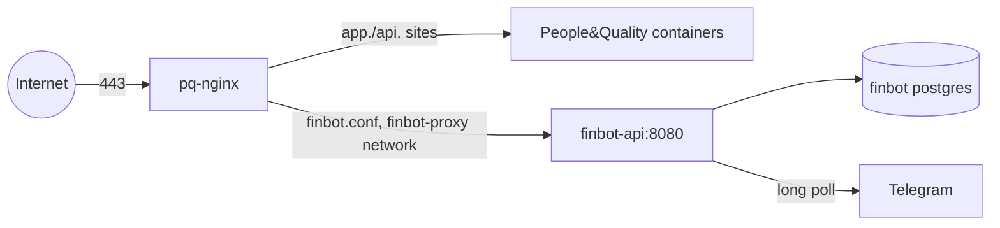

# Deploy next to another stack's nginx

Use this when finbot shares a VPS with a stack that already owns ports 80
and 443 through its own nginx container (here: the People&Quality stack,
`pq-nginx`, in `/opt/peopleandquality`). finbot then runs without Caddy, and
that nginx serves the API with one extra site file. Everything else in
[deploy-hostinger.md](deploy-hostinger.md) still applies.



## Rules that protect the other stack

- finbot lives in **one file**, `conf.d/finbot.conf`. Never edit the other
  stack's `default.conf`.
- Only `scripts/install-nginx-vhost.sh` writes that file. It runs `nginx -t`
  inside the running container and restores the previous state if the check
  fails. The other stack's deploys run `nginx -s reload || true`, so a broken
  file would not stop their deploy; nginx would keep stale upstreams and
  their sites would answer 502.
- The site resolves `finbot-api` per request (`resolver 127.0.0.11`). With
  finbot stopped, only the finbot host answers 502; nginx still starts and
  serves the other sites.
- finbot publishes no ports and runs with CPU and memory limits
  (`compose.proxy.yml`).

## Steps

1. **DNS.** Point an A record for the API host (e.g. `finbot.example.com`)
   at the VPS. On Cloudflare, start with the record **DNS only** (grey cloud).
2. **Checkout and settings** on the VPS:

   ```sh
   git clone https://github.com/GabrielSSJ7/telegram-finance.git /opt/finbot
   cd /opt/finbot
   cat > .env <<'ENV'
   COMPOSE_FILE=compose.yml:compose.proxy.yml
   PROXY_CONTAINER=pq-nginx
   API_DOMAIN=finbot.example.com
   # Unused without Caddy, but compose.yml requires a value.
   ACME_EMAIL=unused@example.com
   ALLOWED_TELEGRAM_USER_IDS=111111111,222222222
   AGE_RECIPIENTS=age1...,age1...
   HOUSEHOLD_TIMEZONE=America/Sao_Paulo
   ENV
   ./scripts/init-secrets.sh        # prompts for the bot token
   ```

3. **Certificate.** The other stack's port-80 server answers ACME challenges
   for any host from the webroot volume, so no finbot file is needed yet:

   ```sh
   certbot certonly --webroot \
     -w /var/lib/docker/volumes/peopleandquality_certbot-webroot/_data \
     -d finbot.example.com
   ```

   The host's nightly `certbot renew` (same webroot) renews it and reloads
   `pq-nginx`. Its expiry alert only watches the People&Quality certificate.

4. **Start finbot:** `./scripts/deploy.sh v0.1.0`. This also attaches
   `pq-nginx` to the `finbot-proxy` network.
5. **Publish the site:**

   ```sh
   ./scripts/install-nginx-vhost.sh finbot.example.com \
     /opt/peopleandquality/nginx/conf.d pq-nginx
   curl -fsS https://finbot.example.com/healthz
   ```

6. **API key:** `docker compose exec finbot finbot api-key create phone`.

## Day to day

- **Releases:** GitHub Actions cannot reach port 22 on Hostinger (their
  firewall drops GitHub's address ranges), so keep `AUTO_DEPLOY` off and run
  `./scripts/deploy.sh <tag>` over SSH. Do not register a self-hosted runner
  for this repository: it is public, and pull requests from forks could run
  code on the server.
- **502 on the finbot host only:** the other stack recreated `pq-nginx`,
  which drops it from `finbot-proxy`. Run
  `docker network connect finbot-proxy pq-nginx` (or any deploy).
- **Rollback:** `./scripts/deploy.sh <previous tag>`. The host prunes images
  older than a day, so the old image is pulled again.
- **Monitoring:** the host's health monitor reports every unhealthy
  container, finbot's included, to the People&Quality alert bot.
- **Behind the Cloudflare proxy (orange cloud):** set SSL mode to Full
  (strict). The API then sees Cloudflare's addresses, so its per-IP rate
  limit is shared by everyone behind the same edge.

## Removing finbot from the host

```sh
rm /opt/peopleandquality/nginx/conf.d/finbot.conf
docker exec pq-nginx nginx -t && docker exec pq-nginx nginx -s reload
docker network disconnect finbot-proxy pq-nginx
cd /opt/finbot && docker compose down      # add -v to delete the data too
certbot delete --cert-name finbot.example.com
```
